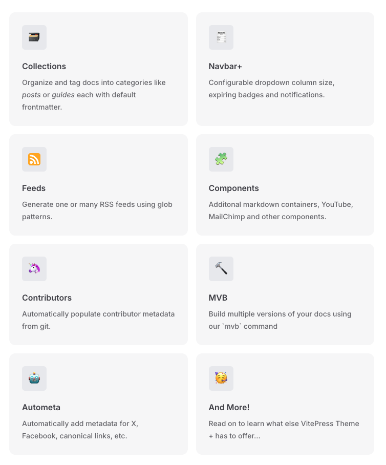

# VitePress Default Theme +

This extends the [default VitePress theme](https://vitepress.dev/) with some extra power and features such as:

Or just go to the [docs](https://vitepress-theme-default-plus.lando.dev) for the docs to learn more.

## Docs

* [Overview](https://vitepress-theme-default-plus.lando.dev/overview)
* [Installation](https://vitepress-theme-default-plus.lando.dev/install.html)
* [Usage](https://vitepress-theme-default-plus.lando.dev/usage.html)
* [Configuration](https://vitepress-theme-default-plus.lando.dev/config/config.html)
* [Guides](https://vitepress-theme-default-plus.lando.dev/guides.html)
* [Examples](https://github.com/lando/vitepress-theme-default-plus)
* [Development](https://vitepress-theme-default-plus.lando.dev/development.html)

## Issues, Questions and Support

If you have a question or would like some community support we recommend you [join us on Slack](https://launchpass.com/devwithlando). Note that this is the Slack community for [Lando](https://lando.dev) but we are more than happy to help with this module as well!

If you'd like to report a bug or submit a feature request then please [use the issue queue](https://github.com/lando/vitepress-theme-default-plus/issues/new/choose) in this repo.

## Changelog

We try to log all changes big and small in both [THE CHANGELOG](https://github.com/lando/vitepress-theme-default-plus/blob/main/CHANGELOG.md) and the [release notes](https://github.com/lando/vitepress-theme-default-plus/releases).

## Releasing

To deploy and publish a new version of the package to the `npm` registry you need only [create a release on GitHub](https://docs.github.com/en/repositories/releasing-projects-on-github/managing-releases-in-a-repository) with a [semver](https://semver.org) tag.

Note that prereleases will get pushed to the `edge` tag on the `npm` registry.

## Maintainers

* [@pirog](https://github.com/pirog)
* [@reynoldsalec](https://github.com/reynoldsalec)

## Contributors

Made with [contributors-img](https://contrib.rocks).

## Other Resources

* [Important advice](https://www.youtube.com/watch?v=WA4iX5D9Z64)
